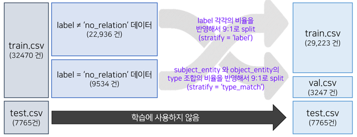
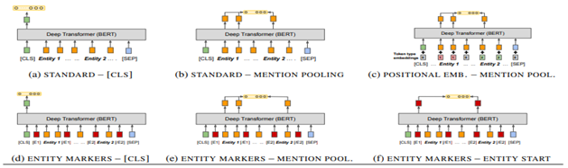
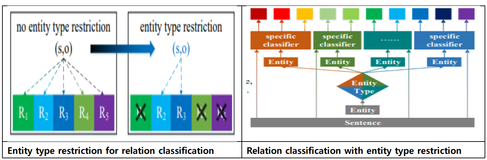

<div align='center'>

# Lv.2 NLP KLUE 프로젝트 : 문장 내 개체간 관계 추출(RE)

</div>


## **개요**
> 진행 기간: 24년 1월 3일 ~ 24년 1월 18일

> 데이터셋: 
> - 학습 데이터셋 32,470개
> - 평가 데이터는 7,765개  
>
> 평가 데이터의 50%는 Public 점수 계산에 활용되어 실시간 리더보드에 표기가 되고, 남은 50%는 Private 결과 계산에 활용되었습니다.

부스트캠프AI Tech 6기의 9, 10, 11주 차 과정으로 NLP KLUE 대회입니다. 주제는 ‘문장 내 개체간 관계 추출’으로, 문장의 단어(Entity)에 대한 속성과 관계를 예측하는 자연어처리 N21 태스크인 관계 추출(Relation Extraction, RE)을 진행했습니다. 문장과 문장 내 subject_entity와 object_entity가 주어졌을 때 두 entity의 관계를 주어진 30개의 라벨 중 하나로 분류하는 task를 수행했습니다. `no-relation` 라벨을 제외한 **micro-f1 score**와 **auprc**로 평가합니다.

## 리더보드 결과
<div align="left">
    </img> </img>
    <br>
    </img>
</div>

## Fin-GPT
<div align='center'>

|권예진 [](https://github.com/Becky-Kwon)|문지원 [](https://github.com/jwmooon)|방제형 [](https://github.com/BJH9)|이경재 [](https://github.com/EbanLee))|이종원 [](https://github.com/jongwoncode)|
|:-:|:-:|:-:|:-:|:-:|
|</img>|</img>|</img>|</img>|</img>|

</div>

## 역할 분담

<div align='center'>

|팀원| 역할 |
|:---:| --- |
| 권예진 | EDA, validation set 구성, 앙상블 실험, K-Fold, marker 실험, GitHub 이슈및 main PR관리 |
| 문지원 | 모델 탐색 및 실험, EDA, focal loss 구현 및 실험, WandB logging 구현 |
| 방제형 | EDA, 데이터 증강 방법 탐색 및 실험, GitHub main PR 관리, 개체 타입 제한 실험 |
| 이경재 | 모델 탐색 및 실험, prompt 실험, entity embedding 구현 및 실험, dropout rate 실험 |
| 이종원 | 코드 리팩토링 및 관리, 전처리 및 prompt, marker 실험, matching the blanks 실험 |

</div>


## 프로젝트 구조도

<div align='center'>

</img>

</div>

## 개발/협업 환경

### 하드웨어
> **Tesla V100 32GB** * 5EA

### 소프트웨어 및 라이브러리
```
python==3.10.13
torch==2.1.0
pytorch-lightning==2.1.2
transformers==4.35.2
pandas==2.1.3
pyprnt==2.5.3
wget==3.2
wandb==0.16.1
```
### GitHub
현업에서 진행하는 방식을 최대한 따르려고 노력했습니다. 이슈와 PR 템플릿을 작성하고, 팀 내의 커밋 컨벤션 규칙을 작성하여 후에 봐도 통일된 모습으로 쉽게 변경 사항을 찾을 수 있도록 했습니다. 기본 템플릿을 main 브랜치로 둔 뒤에, dev 브랜치에서 개발을 진행하였습니다. dev 브랜치에서도 새로운 기능을 개발할 때는 새로운 브랜치로 분기를 만들어 진행한 뒤 작성이 끝나면 dev으로 리퀘스트를 작성하고, 팀원의 리뷰를 받은 뒤 병합을 진행하였습니다.

### Notion
메인 Task 보드를 두고, 그곳에 자신의 업무 페이지를 작성하여 담당자를 할당한 후, 태그를 준비/진행 중/완료로 나누어 진 행 상황을 공유했습니다. 해당 페이지에는 본인의 작업 기간을 표시하여 타임라인으로도 활용했습니다.
그리고 정보와 자료의 공유 공간으로 사용했습니다. 자신은 익숙하지만, 팀원들은 모를 수 있는 팁을 직접 작성하기도 하고, 팀원들이 읽어봤으면 하는 레퍼런스를 공유했습니다.

### 프로젝트 템플릿
주어진 Baseline 코드는 모델, 데이터로더, 학습까지 하나의 파일에 전부 작성되어 있었습니다. 앞으로 진행할 다른 대회에도 사용할 수 있도록 프로젝트 템플릿을 작성하여 그에 맞게 모듈화하여 구획하였습니다. 디렉토리는 원활한 실험을 위한 설정 파일을 담은 config, 학습, 검증, 평가, 증강 데이터를 담은 data, 학습이 끝난 모델과 inference 결과를 저장하는 output, 학습된 모델의 파라미터를 저장하는 checkpoint, Jupyter Notebook 작업을 수행하는 notebook, 데이터 전처리와 증강 등 다양한 곳에 사용한 모듈을 저장하는 utils으로 구분했습니다. 
```
public 전환 후 그려질 예정
📦 level2-KLUE-nlp-10
├─ .gitihub
│  ├─ ISSUE_TEMPLATE
│  │  ├─ bug_report.md
│  │  ├─ experiment.md
│  │  └─ feature_request.md
│  └─ PULL_REQUEST_TEMPLATE.md
├─ checkpoint
├─ config
│  └─ config.yaml
├─ data
│  ├─ dev.csv
│  ├─ sample_submission.csv
│  ├─ test.csv
│  └─ train.csv
├─ img
│  ├─ roadmap.png
│  └─ timeline.png
├─ notebook
│  └─ 
├─ output
│  ├─ model.pt
│  ├─ model.csv
│  └─ output.csv
├─ utils
│  ├─ augmentation.py
│  ├─ concat_data.py
│  ├─ rm_duplicates+sort.py
│  ├─ scatter.py
│  ├─ simple_bagging.py
│  └─ undersampling.py
├─ .gitignore
├─ README.md
├─ data_loader.py
├─ inference.py
├─ requirements.txt
├─ run.py
└─ train.py
```

## 프로젝트 로드맵

<div align='center'>

</img>

</div>

## 데이터 
### Label 별 데이터셋 특징

<div align='center'>

|id|sentence|subject_entity|object_entity|label|source|
|--|--|--|--|--|--|
|0|〈Something〉는 조지 해리슨이 쓰고 비틀즈가 1969년 앨범 《Abbey Road》에 담은 노래다.|"{'word': '비틀즈', 'start_idx': 24, 'end_idx': 26, 'type': 'ORG'}"|"{'word': '조지 해리슨', 'start_idx': 13, 'end_idx': 18, 'type': 'PER'}"|**no_relation**|wikipedia|
|1|호남이 기반인 바른미래당·대안신당·민주평화당이 우여곡절 끝에 합당해 민생당(가칭)으로 재탄생한다.|"{'word': '민주평화당', 'start_idx': 19, 'end_idx': 23, 'type': 'ORG'}"|"{'word': '대안신당', 'start_idx': 14, 'end_idx': 17, 'type': 'ORG'}"|**no_relation**|wikitree|
|2|"이른바 'Z세대'로 불리는 1990년대 중반 이후 태어난 세대에게 대표 아이콘으로 통하는 미국 싱어송라이터 빌리 아일리시(본명 빌리 오코널, 19)가 팝 역사를 새로 썼다."|"{'word': '빌리 아일리시', 'start_idx': 60, 'end_idx': 66, 'type': 'PER'}"|"{'word': '싱어송라이터', 'start_idx': 53, 'end_idx': 58, 'type': 'POH'}"|**per:title**|wikitree|

</div>

### Validation set 생성과 최종 데이터셋 확정
<div align='center'>
</img>
</div>

### 데이터 증강
Back translation 방식을 활용했다. Google API로 한글을 영어로 번역한 뒤, 다시 한글로 번역하여 새로운 문장을 생성했다. 

<br>

## 데이터 전처리와 성능 확인
### Marker 사용
데이터의 라벨이 entity type과 밀접한 연관이 있다는 인사이트에 근거하여 sentence에 entity type 정보를 넣어줄수 있는 방법을 모색하고자 Marker를 사용

|**Prompt type**|**Input example**|**micro-f1**|
|:--:|--|--|
|**s_sep_o**|이순신[SEP]무신[SEP]이순신은 조선 중기의 무신이다.|70.75|
|**s_and_o(와)**|이순신과 무신의 관계[SEP]이순신은 조선 중기의 무신이다.|72.51|
|**s_sep_o(&)**|이순신 & 무신의 관계[SEP]이순신은 조선 중기의 무신이다.|72.49|
|**question**|이순신은 조선 중기의 무신이다.[SEP]이순신과 무신의 관계는 무엇입니까?|72.22|

### prompt 활용
|**Marker Type**|**Input Example**|**micro-f1**|
|--|--|--|
|**Basline**|이순신은 조선의 무신이다.|72.51|
|**Entity Mask**|[SUB-PER]은 조선의 [OBJ-JOB] 이다.|-|
|**Entity Marker**|[E1] 이순신 [/E1]은 조선의 [E2] 무신 [/E2]이다.|-|
|**Entity Marker Punct**|@ 이순신 @ 은 조선의 # 무신 # 이다.|-|
|**Typed Entity Marker**|<S:PERSON> 이순신 </S:PERSON>은 조선의 <O:JOB> 무신 </O:JOB>이다.|72.78|
|**Typed Entity Marker Punct**|@ * 사람 * 이순신 @은 조선의 # ^ 직업 ^ 무신 # 이다.|73.45|
|**Typed Entity Marker PunctV2**|@ * 사람 * 이순신 @은 조선의 $ ^ 직업 ^ 무신 $ 이다.|73.73|
|**Typed Entity Marker Non Object Type**|<S:PERSON> 이순신 </S:PERSON>은 조선의 <O> 무신 </O>이다.|72.93|

<br>


## 아키텍쳐 보완

### Matching the Blank (MTB) 구현
Matching the blanks는 CLS 토큰 대신, Entity에 해당하는 token을 사용하여 RE task를 수행하여 성능 개선을 도모했다는 연구입니다. 
"ENTITY MARKERS – ENTITY START"를 구현했고, 뒤에 존재하는 ENTITY MARKER 토큰까지 사용하는 "ENTITY MARKERS – ENTITY START END"를 구현했다. 또한, CLS는 중요한 정보를 담고 있다고 생각했기에 CLS 토큰을 포함하도록 구현했습니다.
- ENTITY MARKERS - [CLS] (Baseline) : [CLS] 토큰 사용.
- ENTITY MARKERS - ENTITY START + [CLS] : [CLS], [E1] 토큰 사용.
- ENTITY MARKERS - ENTITY START END + [CLS] : [CLS], [E1], [/E1] 토큰 사용.

<div align='center'>
</img>
    
|marker|matching the blank type |micro-f1|
|--|--|--|
|typed entity marker|no|72.78|
|typed entity marker|entity start|73.38|
|typed entity marker|entity start end|73.70|
</div>


### Relation Classification with Entity Type Restriction (RECETNT) 구현
subject entity type과 object entity type의 조합이 추출해낼 수 있는 relation 유형이 제한되어 있으므로, Relation classification을 위해 entity type의 조합을 classifier에서 한정하는 방법론이다. 
<div align='center'>
</img>
</div>


### K-fold 구현
과적합을 방지하기 위해 K-fold 교차 검증을 시행했습니다. Ttrain 데이터는 5개의 폴드로 나누었고, 기존의 dev 데이터는 최종 학습 평가에 사용했습니다. 하지만 결과는 기대에 미치지 못했습니다. 일부 폴드에서는 적은 에포크 후에 학습이 조기 종료되었고, 매우 낮은 성능을 보였습니다. 이는 앞서 언급한 대로, train 데이터의 불균형 때문으로 추정됩니다.

### Early Stopping 구현
학습시간을 줄이고 모델의 과적합을 방지하기 위하여 모델의 성능 개선이 미미할 때 조기에 학습을 종료시키는 early stopping을 적용하였습니다. patience값은 주로 3~5로 설정했습니다.

### Learning Rate Scheduler 사용 및 Padding 추가 구현
일정한 LR 사용 시 학습 초기에는 모델의 수렴 속도가 늦춰지고 학습 후기에는 최적해 근처에서 진동하는 문제가 있습니다. 이를 보완하기 위해서 LR Scheduler를 이용하여 학습 초기에는 큰 값의 LR을 부여하여 수렴을 빠르게 하고, 이를 점차 감소시키며 좀 더 정밀하게 최적해를 찾게 했습니다. 이를 구현하기 위해 transformer 라이브러리의 ‘get_linear_schedule_with_ warmup’을 사용했습니다.  
또한 collate_fn을 통해 배치 단위로 padding을 추가했습니다. 일부 사전 학습된 모델의 경우 입력 길이에 차이가 있으면 에러가 발생했습니다. 이를 해결하고자 transformers의 ‘DataCollatorWithPadding’을 사용하였고 덕분에 보다 보편적인 실험 환경을 갖출 수 있었습니다.

## Model 선택 및 앙상블

<div align='center'>

|  | 모델 | 데이터 | 비율 |
|:---:|:---|:---|:---:|
| **A** | snunlp/KR-ELECTRA-discriminator | train+dev (shuffle 8:2) | 0.3 |
| **B** | snunlp/KR-ELECTRA-discriminator (stacking) | train + swap data | 0.2 |
| **C** | beomi/KcELECTRA-base | train + swap data | 0.2 |
| **D** | team-lucid/deberta-v3-xlarge-korean | train data | 0.3 |
| **E** | xlm-roberta-large (PERSON 토큰 추가) | train data | 0.1 |

</div>

## 최종결과

> **총 제출 횟수: 56**

<div align='center'>

| 순위 | 분류 | 점수(Pearson Correlation) |
|:---:| --- |:---:|
| 🥇 | Public Score (대회 진행) | 0.9374 |
| 🥇 | Private Score (최종) | 0.9428 |

</div>

