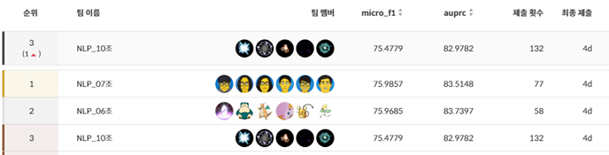

<div align='center'>

# Lv.2 NLP KLUE 프로젝트 : 문장 내 개체간 관계 추출(RE)

</div>


## **개요**
> 진행 기간: 23년 12월 13일 ~ 23년 12월 21일

> 데이터셋: 
> - 학습 데이터셋 9,324개
> - 검증 데이터셋 550개
> - 평가 데이터는 1,100개  
>
> 평가 데이터의 50%는 Public 점수 계산에 활용되어 실시간 리더보드에 표기가 되고, 남은 50%는 Private 결과 계산에 활용되었습니다.

부스트캠프AI Tech 6기의 6주 차, 7주 차 과정으로 NLP 기초 대회입니다. 주제는 ‘문장 간 유사도 측정’으로, 두 문장이 얼마나 유사한지를 수치화하는 자연어처리 N21 태스크인 의미 유사도 판별(Semantic Text Similarity, 이하 STS)을 진행했습니다. 학습 데이터에 주어진 문장 두 개와 유사도 점수를 기반으로 평가 데이터의 두 문장 간의 유사도를 0과 5 사이의 값으로 예측하는 모델을 구축하였습니다.

## 리더보드 결과
<div align="left">
    </img> </img>
    </img>
</div>

## 해결사
<div align='center'>

|구희찬 [](https://github.com/kooqooo)|권예진 [](https://github.com/Becky-Kwon)|김진기 [](https://github.com/jingi-data)|김희범 [](https://github.com/C7C4FF)|박준우 [](https://github.com/doodaad)|손유림 [](https://github.com/alwaysday4u)|
|:-:|:-:|:-:|:-:|:-:|:-:|
|</img>|</img>|</img>|</img>|</img>|</img>|

</div>

## 역할 분담

<div align='center'>

|팀원| 역할 |
|:---:| --- |
| 구희찬 | 데이터 증강 기법 탐색 및 실험, 데이터 분포 시각화 및 앙상블 유틸리티 생성, 파인 튜닝 |
| 권예진 | 모델 탐색 및 실험, 베이스라인 관리, 분류 코드 관리 총괄, 기계번역 데이터 증강 및 앙상블 실험 |
| 김진기 | 개발, 협업 환경 및 베이스라인 관리, 데이터 분포 관리, 모델 탐색 및 실험, 앙상블 코드 작성 및 실험 |
| 김희범 | 개발, 협업 환경 및 베이스라인 관리, 데이터 품질 관리 및 실험, 모델 탐색 및 실험 |
| 박준우 | 모델 탐색 및 실험, 다중 분류 코드 작성, 기계번역 데이터 증강 및 실험 |
| 손유림 | 데이터 증강 코드 작성 및 모듈 관리, 분류 코드 실험 보조, 기계번역 데이터 증강 및 실험 |

</div>


## 프로젝트 구조도

<div align='center'>

</img>

</div>

## 개발/협업 환경

### 하드웨어
> **Tesla V100 32GB** * 6EA

### 소프트웨어 및 라이브러리
```
python==3.10.13
torch==2.1.0
pytorch-lightning==2.1.2
transformers==4.35.2
pandas==2.1.3
pyprnt==2.5.3
PyYAML==6.0
wget==3.2
wandb==0.16.1
```
### GitHub
현업에서 진행하는 방식을 최대한 따르려고 노력했습니다. 이슈와 PR 템플릿을 작성하고, 팀 내의 커밋 컨벤션 규칙을 작성하여 후에 봐도 통일된 모습으로 쉽게 변경 사항을 찾을 수 있도록 했습니다. 기본 템플릿을 main 브랜치로 둔 뒤에, develop 브랜치에서 개발을 진행하였습니다. develop 브랜치에서도 새로운 기능을 개발할 때는 새로운 브랜치로 분기를 만들어 진행한 뒤 작성이 끝나면 develop으로 리퀘스트를 작성하고, 팀원의 리뷰를 받은 뒤 병합을 진행하였습니다.

### Notion
메인 보드를 두고, 그곳에 자신의 업무 페이지를 작성하여 담당자를 할당한 후, 태그를 준비/진행 중/완료로 나누어 진 행 상황을 공유했습니다. 해당 페이지에는 본인의 작업 기간을 표시하여 타임라인으로도 활용했습니다. 가독성과 집중을 위해 대회 1주 차에 작성된 것들은 따로 탭을 만들어 저장하여 주마다 주요한 것들을 바로 확인할 수 있도록 했습니다.
그리고 정보와 자료의 공유 공간으로 사용했습니다. 자신은 익숙하지만, 팀원들은 모를 수 있는 팁을 직접 작성하기도 하고, 팀원들이 읽어봤으면 하는 레퍼런스를 공유했습니다.

### 프로젝트 템플릿
주어진 Baseline 코드는 모델, 데이터로더, 학습까지 하나의 파일에 전부 작성되어 있었습니다. 앞으로 진행할 다른 대회에도 사용할 수 있도록 프로젝트 템플릿을 작성하여 그에 맞게 모듈화하여 구획하였습니다. 디렉토리는 원활한 실험을 위한 설정 파일을 담은 config, 학습, 검증, 평가, 증강 데이터를 담은 data, 학습이 끝난 모델과 inference 결과를 저장하는 output, 학습된 모델의 파라미터를 저장하는 checkpoint, Jupyter Notebook 작업을 수행하는 notebook, 데이터 전처리와 증강 등 다양한 곳에 사용한 모듈을 저장하는 utils으로 구분했습니다. 
```
📦 level1-semantictextsimilarity-nlp-04
├─ .gitihub
│  ├─ ISSUE_TEMPLATE
│  │  ├─ bug_report.md
│  │  ├─ experiment.md
│  │  └─ feature_request.md
│  └─ PULL_REQUEST_TEMPLATE.md
├─ checkpoint
├─ config
│  └─ config.yaml
├─ data
│  ├─ dev.csv
│  ├─ sample_submission.csv
│  ├─ test.csv
│  └─ train.csv
├─ img
│  ├─ roadmap.png
│  └─ timeline.png
├─ notebook
│  └─ 
├─ output
│  ├─ model.pt
│  ├─ model.csv
│  └─ output.csv
├─ utils
│  ├─ augmentation.py
│  ├─ concat_data.py
│  ├─ rm_duplicates+sort.py
│  ├─ scatter.py
│  ├─ simple_bagging.py
│  └─ undersampling.py
├─ .gitignore
├─ README.md
├─ data_loader.py
├─ inference.py
├─ requirements.txt
├─ run.py
└─ train.py
```

## 프로젝트 로드맵

<div align='center'>

</img>

</div>

## 데이터 
### **Source 별 데이터셋 특징**
데이터셋의 출처는 총 3가지 source로 구성되어 있습니다. 먼저 petition 데이터셋은 국민청원 게시판 제목 데이터로, 대체로 오탈자가 적은 격식체의 문장들로 구성되어 있습니다. NSMC(Naver Sentiment Movie Corpus) 데이터셋은 네이버 영화 감성 분석 코퍼스로, 문어체와 구어체가 섞여 있었고, 일부 문장에서 특수문자가 발견되었습니다. Slack 데이터셋은 Upstage에서 제공한 slack 데이터셋으로, 전반적으로 구어체의 문장으로 구성되어 있었으며, 오탈자와 함께 문장 부호, 특수문자(이모티콘, 이모지 등)가 발견되었습니다.

<div align='center'>

| channel | sentence_1 | sentence_2 |
|:---:|:---|:---|
| **nsmc** | 혹평하신분들은 로맨틱코메디를 얼마나 심오하게 보시는분들인지는 모르겠지만 개인적으로는 가볍게 기분좋게 보기 좋은 영화라고 생각합니다.. | 로맨틱코미디를 비판하는 사람들이 얼마나 심한지는 모르겠지만 개인적으로는 가볍게 보기 좋은 영화라고 생각한다. |
|  | 울면서 본 영화다. | 울컥 하면서 보는 드라마입니다. |
|  | 킹콩이면 도대체 콩진호가 얼마나 큰 건가요? | . 콩진호가 나가신다! |
| **petition** | 심평원, 한전 회식카드지출비 해외출장비 지원자금 조사의뢰 건 | 공동주택 일자리안정자금에 대한 문제점(미화원, 경비원 2019년 임금 동결건) |
|  | 고등학생도 휴업 해주세요. | 근로자의 휴식권을 찾아주세요.. |
|  | 청소년법 폐지 간곡히 요청합니다 | 청소년보호법 폐지 간곡히 부탁드립니다. |
| **slack** | 제가 모르는 종목도 많이 알고 계셨습니다. | 제가 있던 테이블에서도 너무나 가슴 뛰는 아이디어도 많이 나누었습니다. |
|  | 두 분 어디 도장깨기 하러 가시는가요… ㅋㅋㅋ | 둘이 봉인을 어디서 뜯으려나... 하하하 |
|  | 너무 감사드립니다 ㅠㅠ | 너무 부럽습니다 ㅠㅠ |

</div>

### Label 별 데이터셋 특징

<div align='center'>

| Label 구간 | sentence_1 | sentence_2 | 특징 |
|:---:|:---|:---|:---|
| 5.0 | 검정고시가 페지되어야 한다고 봅니다 | 검정고시 페지해야 한다고 봅니다 | 문장부호의 개수 및 띄어쓰기, 조사가 생략되거나 하는 다소의 차이가 존재하나, 문장이 거의 일치합니다. |
| 4.0 ~ 4.9 | 나는 이걸 왜 보았을까?? | 이거 내가 왜 봤지? | 문장의 의미가 거의 일치하나, 단어의 어순이 다르거나 일부 단어가 유의어로 교체되었습니다. |
| 3.0 ~ 3.9 | 히딩크감독을 다시 대한민국 축구 감독으로 | 히딩크감독님을 모셔와야합니다 | 문장의 맥락이 거의 일치하나, 주요한 보어 혹은 목적어가 누락되거나 유의어 대체 등에서 뚜렷한 차이를 보입니다. |
| 2.0 ~ 2.9 | 대회 때문에 정신 없어서 오늘 올립니다. | 오늘은 대회로 바쁘지 않아서 올립니다. | 문장에서 다루는 주제와 상황은 유사하지만, 읽는 사람에 따라 다르게 해석될 여지가 있습니다. |
| 1.0 ~ 1.9 | 다크나이트와 함께 최고의 히어로물 | 히트했던 드라마인 각시탈 또한 제대로된 히어로물입니다; | 일부 단어가 일치하거나 주제는 유사하지만, 서로 다른 의미를 가지는 문장입니다. |
| 0.1 ~ 0.9 | 공짜로 주어지는 것은 아무 것도 없다. | 아무 것도 남는게 없다.. | 일부 단어는 일치하나, 맥락과 의미가 전혀 다릅니다. |
| 0.0 | 부모님 댁으로 받았는데 너무 맛있다고 하셔요!! ㅎㅎㅎ | 타고 싶은데 넘 비싸요 ㅎㅎ | 공통점이 없는 전혀 다른 문장입니다. |

</div>

## 아키텍쳐 보완

### Stacking 구현
데이터에 주어진 ‘binary-label’을 활용하여 회귀와 이진 분류를 동시에 수행하는 모델을 만들었습니다. 이진 분류를 통해 예측 범위를 좁혀 보다 정밀한 예측을 기대했습니다. Stacking은 매개변수 공유 여부에 따라 두 가지 방식으로 구현했습니다. 매개변수 공유가 있는 경우에는 하나의 모델을 사용했습니다. AutoModel의 출력은 Classification head에서 0 또는 1로 분류되고, 해당하 Regression head로 전파됩니다. 매개변수 공유가 없는 경우에는 두 개의 모델을 사용했습니다. 하나의 모델 출력을 사용하여 이진 분류를 수행한 뒤, 다른 모델의 출력값을 이 분류에 맞게 Regression head로 전달합니다. 두 방식의 성능은 대체로 비슷했습니다. 매개변수 공유가 있는 방식은 학습 속도가 빠르고, 매개변수 공유가 없는 방식은 과적합에 있어 안정적인 모습을 보였습니다. 하지만 두 방식 모두 validation 과정에서 상당한 과적합이 나타났습니다. 특히 사전 학습 모델의 규모가 커질수록 이러한 문제가 두드러졌습니다. 이는 모델이 복잡해질 때 나타나는 특징으로 보입니다.

### K-fold 구현
과적합을 방지하기 위해 K-fold 교차 검증을 시행했습니다. Ttrain 데이터는 5개의 폴드로 나누었고, 기존의 dev 데이터는 최종 학습 평가에 사용했습니다. 하지만 결과는 기대에 미치지 못했습니다. 일부 폴드에서는 적은 에포크 후에 학습이 조기 종료되었고, 매우 낮은 성능을 보였습니다. 이는 앞서 언급한 대로, train 데이터의 불균형 때문으로 추정됩니다.

### Early Stopping 구현
학습시간을 줄이고 모델의 과적합을 방지하기 위하여 모델의 성능 개선이 미미할 때 조기에 학습을 종료시키는 early stopping을 적용하였습니다. patience값은 주로 3~5로 설정했습니다.

### Learning Rate Scheduler 사용 및 Padding 추가 구현
일정한 LR 사용 시 학습 초기에는 모델의 수렴 속도가 늦춰지고 학습 후기에는 최적해 근처에서 진동하는 문제가 있습니다. 이를 보완하기 위해서 LR Scheduler를 이용하여 학습 초기에는 큰 값의 LR을 부여하여 수렴을 빠르게 하고, 이를 점차 감소시키며 좀 더 정밀하게 최적해를 찾게 했습니다. 이를 구현하기 위해 transformer 라이브러리의 ‘get_linear_schedule_with_ warmup’을 사용했습니다.  
또한 collate_fn을 통해 배치 단위로 padding을 추가했습니다. 일부 사전 학습된 모델의 경우 입력 길이에 차이가 있으면 에러가 발생했습니다. 이를 해결하고자 transformers의 ‘DataCollatorWithPadding’을 사용하였고 덕분에 보다 보편적인 실험 환경을 갖출 수 있었습니다.

## Model 선택 및 앙상블

<div align='center'>

|  | 모델 | 데이터 | 비율 |
|:---:|:---|:---|:---:|
| **A** | snunlp/KR-ELECTRA-discriminator | train+dev (shuffle 8:2) | 0.3 |
| **B** | snunlp/KR-ELECTRA-discriminator (stacking) | train + swap data | 0.2 |
| **C** | beomi/KcELECTRA-base | train + swap data | 0.2 |
| **D** | team-lucid/deberta-v3-xlarge-korean | train data | 0.3 |
| **E** | xlm-roberta-large (PERSON 토큰 추가) | train data | 0.1 |

</div>

## 최종결과

> **총 제출 횟수: 56**

<div align='center'>

| 순위 | 분류 | 점수(Pearson Correlation) |
|:---:| --- |:---:|
| 🥇 | Public Score (대회 진행) | 0.9374 |
| 🥇 | Private Score (최종) | 0.9428 |

</div>
